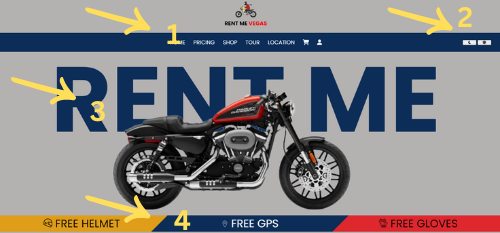

###  Landing page project ( motorbikes rental company )
##### Using :
  

#### https://rentmevegas.netlify.app/
#### https://revou-fsse-5.github.io/milestone-1-conkehlicious/ 
#### https://thongthong.my.id/

<h2> Website features :</h2> 

##### 1. Sticky navbar
##### 2. Dark Mode and Light Mode Buttons
##### 3. Text Animation
##### 4. Transform Skew

<h2>Github Deployment</h2>

##### 1. Go to setting
##### 2. Pages
##### 3. Choose Main and save it
##### 4. Click Action and done

